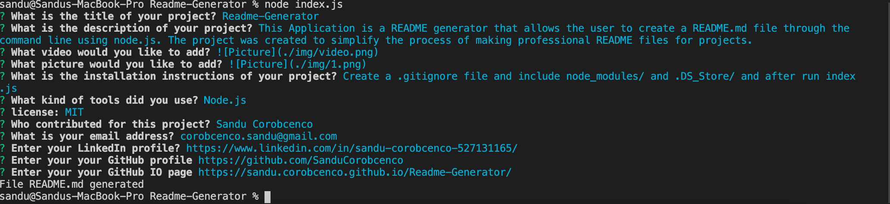

# Readme-Generator

## Table of Contents

- [About-project](#Description)
- [Video](#Video)
- [Picture1](#Picture1)
- [Installation](#Installation)
- [License](#License)
- [Contributor](#Contributor)
- [Email](#Email)
- [LinkedIn-profile](#LinkedIn-profile)
- [GitHub-profile](#GitHub-profile)
- [Website)](#Website)

### About the project:

This Application is a README generator that allows the user to create a README.md file through the command line using node.js. The project was created to simplify the process of making professional README files for projects.

### Video:

[Please follow this *[link](https://drive.google.com/file/d/1c1bkAVQfjBZL-gayQer3biHmQrmACg6d/view)* to watch the walkthrough video.

### Picture:

### Installation:

Create a .gitignore file and include node_modules/ and .DS_Store/ and after run index.js

### Contributor:

Sandu Corobcenco

### License:

MIT

### Email address:

corobcenco.sandu@gmail.com

### LinkedIn profile:

https://www.linkedin.com/in/sandu-corobcenco-527131165/

### GitHub profile:

https://github.com/SanduCorobcenco

### Developed page:

https://sandu.corobcenco.github.io/Readme-Generator/
